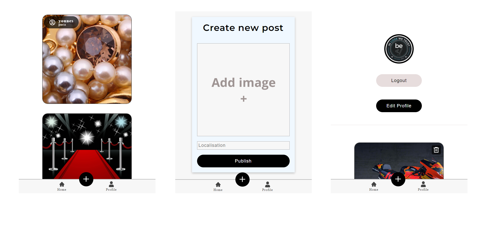

# Amstramgram

*Amstramgram* is a project that recreate the basic features of the famous social network *Instagram*.

---

### Live version [here](https://github.com/ElmiriYounes/Amstramgram)

---

## The team 🙌
* Dalcq Arnaud [(Github Profile)](https://github.com/DalcqArnaud)
* El miri Younes [(Github Profile)](https://github.com/ElmiriYounes)
* Saidi Naïm [(Github Profile)](https://github.com/Saidi-Naim)

[//]: <> (## My job 💻)

[//]: <> (Here is the place where every member write what they have done on the project)

## Stack 📚

**Front**:

* 

* 

* 

**Back**:

* 

* 
 
* 
 
* 

